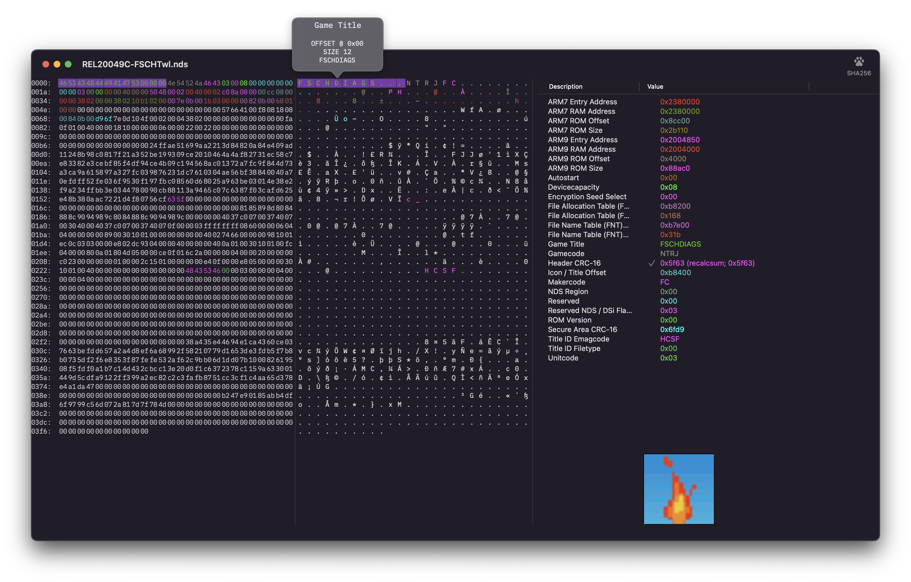

FSCH's "Master Editor"
======================
Sort of inspired by Nintendos (old?) internal software for final ROM validation and submissions.

At the moment just a basic ROM header viewer for Homebrew .nds cartridge dumps or NitroSDK/TwlSDK .srl files. Future plans include adding 3DS ROM file formats, .3ds / .cia / .cci / etc.

Feel free to addon and create pull requests or issues as needed. 